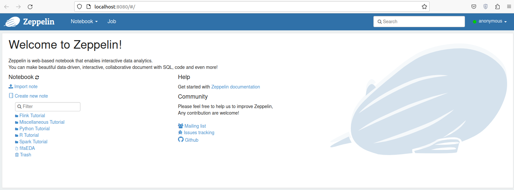

# EDA on FIFA using Apache Spark

Exploratory Data Analysis on FIFA Dataset Using Spark Scala APIs in Apache Zeppelin Notebook.

## Download Zeppelin

```bash
wget https://downloads.apache.org/zeppelin/zeppelin-0.10.0/zeppelin-0.10.0-bin-all.tgz
sudo tar xf zeppelin-*-bin-all.tgz -C /home/hosniadel/app/
sudo mv /home/hosniadel/app/zeppelin-*-bin-all /home/hosniadel/app/zeppelin
```

## ****Configure Systemd****

```bash
sudo useradd -d /home/hosniadel/app/zeppelin -s /bin/false zeppelin
sudo chown -R zeppelin:zeppelin /home/hosniadel/app/zeppelin
sudo nano /etc/systemd/system/zeppelin.service
```

Paste the following in `zeppelin.service` file

```bash
[Unit]

Description=Zeppelin service

After=syslog.target network.target

[Service]

Type=forking

ExecStart=/home/hosniadel/app/zeppelin/bin/zeppelin-daemon.sh start

ExecStop=/home/hosniadel/app/zeppelin/bin/zeppelin-daemon.sh stop

ExecReload=/home/hosniadel/app/zeppelin/bin/zeppelin-daemon.sh reload

User=zeppelin

Group=zeppelin

Restart=always

[Install]

WantedBy=multi-user.target
```

## Configure Zeppelin

1. in `/home/hosniadel/app/zeppelin/conf/zeppelin-site.xml` , set the port to 9090 by default is 8080

```bash
<property>
  <name>zeppelin.server.port</name>
  <value>9090</value>
  <description>Server port.</description>
</property>

```

1. Set JAVA_HOME and SPARK_HOME in zeppeline-env.sh.
2. Start Zeppelin service

```jsx
sudo systemctl start zeppelin
sudo systemctl status zeppelin
sudo systemctl stop zeppelin
```

1. Now, you have access to Zeppelin through http://localhost:8080



## Spark

I have spark v3.0.0 installed 


```bash
export JAVA_HOME=/usr/lib/jvm/java-1.8.0-openjdk-amd64
	export SPARK_HOME=/opt/spark
```

## Start Development

1. Create new note 


1. Load FIFA dataset as csv and make your EDA

> Note: Use `Ctrl+.` to autocomplete in Zeppeline
> 

## My Zeppeline Notebook


## Reference

[https://www.vultr.com/docs/how-to-install-apache-zeppelin-on-ubuntu-16-04/](https://www.vultr.com/docs/how-to-install-apache-zeppelin-on-ubuntu-16-04/)